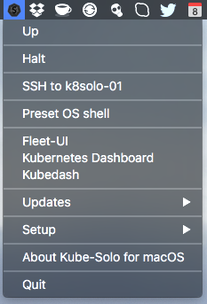

Kubernetes Solo cluster for macOS
============================

Zero to Kubernetes development environment setup under two minutes
---------------

**Kube-Solo for macOS** is a `status bar App` which allows in an easy way to bootstrap and control Kubernetes cluster on a standalone [CoreOS](https://coreos.com) VM machine. VM can also be controlled via `ksolo` cli. Also VM's `docker` API is exposed to macOS, so you can build your docker images with the same app and use them with Kubernetes.


It leverages **macOS native Hypervisor virtualisation framework** of using [corectl](https://github.com/TheNewNormal/corectl) command line tool, so there are no needs to use VirtualBox or any other virtualisation software anymore.

**Includes:** [Helm Classic](https://helm.sh) / [Helm v2](https://github.com/kubernetes/helm) - The Kubernetes Package Manager and an option from shell to install [Deis Workflow PaaS](https://deis.com) on top of Kubernetes with a simple: `$ install_deis`

**App's menu** looks as per image below:



Download
--------
Head over to the [Releases Page](https://github.com/TheNewNormal/kube-solo-osx/releases) to grab the latest release.


How to install Kube-Solo
----------

**Requirements**
 -----------
  - **macOS 10.10.3** Yosemite or later 
  - Mac 2010 or later for this to work.
  - **Note: [Corectl App](https://github.com/TheNewNormal/corectl.app) must be installed, which will serve as `corectld` server daemon control.**
  - [iTerm2](https://www.iterm2.com/) is required, if not found the app will install it by itself.


###Install:

- Download [Corectl App](https://github.com/TheNewNormal/corectl.app) `latest dmg` from the [Releases Page](https://github.com/TheNewNormal/corectl.app/releases) and install it to `/Applications` folder, it allows to start/stop/update [corectl](https://github.com/TheNewNormal/corectl) tools needed to run CoreOS VMs on macOS
- Open downloaded `dmg` file and drag the App e.g. to your Desktop. Start the `Kube-Solo` App and `Initial setup of Kube-Solo VM` will run, then follow the instructions there.

**TL;DR**

- App's files are installed to `~/kube-solo` folder
- App will bootstrap `master+worker` Kubernetes cluster on the single VM
- Mac user home folder is automaticly mounted via NFS (it has to work on Mac end of course) to `/Users/my_user`:`/Users/my_user` on each VM boot, check the [PV example](https://github.com/TheNewNormal/kube-solo-osx/blob/master/examples/pv/nfs-pv-mount-on-pod.md) how to use Persistent Volumes.
- macOS `docker` client is installed to `~/kube-solo/bin` and preset in `OS shell` to be used from there, so you can build `docker` images on the VM and use with Kubernetes
- After successful install you can control `kube-solo` VM via `ksolo` cli as well. Cli resides in `~/kube-solo/bin` and `~/bin`folders and has simple commands: `ksolo start|stop|status|ip|ssh|shell`, just add `~/bin` to your pre-set path.

**The install will do the following:**

* All dependent files/folders will be put under `~/kube-solo` folder in the user's home folder e.g `/Users/someuser/kube-solo`. 
* Will download latest CoreOS ISO image (if there is no such one) and run `corectl` to initialise VM 
* When you first time do install or `Up` after destroying Kube-Solo setup, k8s binary files (with the version which was available when the App was built) get copied to VM, this allows to speed up Kubernetes setup.
* It will install `docker, helmc, helm, deis and kubectl` clients to `~/kube-solo/bin/`
* [Kubernetes Dashboard](http://kubernetes.io/docs/user-guide/ui/) and  [DNS](https://github.com/kubernetes/kubernetes/tree/master/cluster/addons/dns) will be instlled as add-ons
* Via assigned static IP (it will be shown in first boot and will survive VM's reboots) you can access any port on CoreOS VM
* Persistent sparse disk (QCow2) `data.img` will be created and mounted to `/data` for these mount binds and other folders:

```
/data/var/lib/docker -> /var/lib/docker
/data/var/lib/rkt -> /var/lib/rkt
/var/lib/kubelet sym linked to /data/kubelet
/data/opt/bin
/data/var/lib/etcd2
/data/kubernetes
```

How it works
------------

Just start `Kube-Solo` application and you will find a small icon of Kubernetes logo with `S` in the Status Bar.

###Menu options:
* There you can `Up` and `Halt` k8solo-01 VM
* `SSH to k8solo-01` will open VM shell
* Under `Up` OS Shell will be opened after VM boots up and it will have such environment pre-set:

```
kubernetes master - export KUBERNETES_MASTER=http://192.168.64.xxx:8080
etcd endpoint - export ETCDCTL_PEERS=http://192.168.64.xxx:2379
DOCKER_HOST=tcp://192.168.64.xxx:2375
```

```
Path to `~/kube-solo/bin` where macOS clients and shell scripts are stored
```

###ksolo cli options:
* `ksolo start` will start k8solo-01 VM and shell environment will be pre-set as above.
* `ksolo stop` will stop VM
* `ksolo status`will show VM's status
* `ksolo ip` will show VM's IP
* `ksolo ssh` will ssh to VM
* `ksolo shell` will open pre-set shell

###Other menu options:
* [Kubernetes Dashboard](http://kubernetes.io/docs/user-guide/ui/) will show nice Kubernetes Dashboard, where you can check Nodes, Pods, Replication, Deployments, Service Controllers, deploy Apps and etc.
* `Check for App updates` will check for a new app version
* `Updates/Update Kubernetes to the latest version` will update to latest version of Kubernetes.
* `Updates/Change Kubernetes version` will download and install specified Kubernetes version from GitHub.
* `Updates/Update macOS helmc, helm, and deis clients` will update `helmc`, `helm` and `deis` to the latest version.
* `Setup/` will allow you to do:

```
- Change CoreOS Release Channel
- Change VM's RAM size
- Destroy Kube-Solo VM (just deletes data.img file)
- Initial setup of Kube-Solo VM
```

Example output of succesfull Kubernetes Solo install:

````
kubectl cluster-info:
Kubernetes master is running at http://192.168.64.3:8080
KubeDNS is running at http://192.168.64.3:8080/api/v1/proxy/namespaces/kube-system/services/kube-dns
kubernetes-dashboard is running at http://192.168.64.3:8080/api/v1/proxy/namespaces/kube-system/services/kubernetes-dashboard

Cluster version:
Client version: v1.4.0
Server version: v1.4.0

kubectl get nodes:
NAME        STATUS    AGE
k8solo-01   Ready     12s

````


Usage
------------

You're now ready to use Kubernetes cluster.

Some examples to start with [Kubernetes examples](http://kubernetes.io/docs/samples/).

Other CoreOS VM based Apps for macOS
-----------
* Kubernetes Cluster (master + 2 nodes) App - [Kube-Cluster for OS X](https://github.com/TheNewNormal/kube-cluster-osx).

* Standalone CoreOS VM App - [CoreOS macOS](https://github.com/TheNewNormal/coreos-osx).

* CoreOS Cluster (control + 2 nodes) App - [CoreOS-Vagrant Cluster](https://github.com/rimusz/coreos-osx-cluster).

## Contributing

**Kube-Solo for macOS** is an [open source](http://opensource.org/osd) project release under
the [Apache License, Version 2.0](http://opensource.org/licenses/Apache-2.0),
hence contributions and suggestions are gladly welcomed! 
